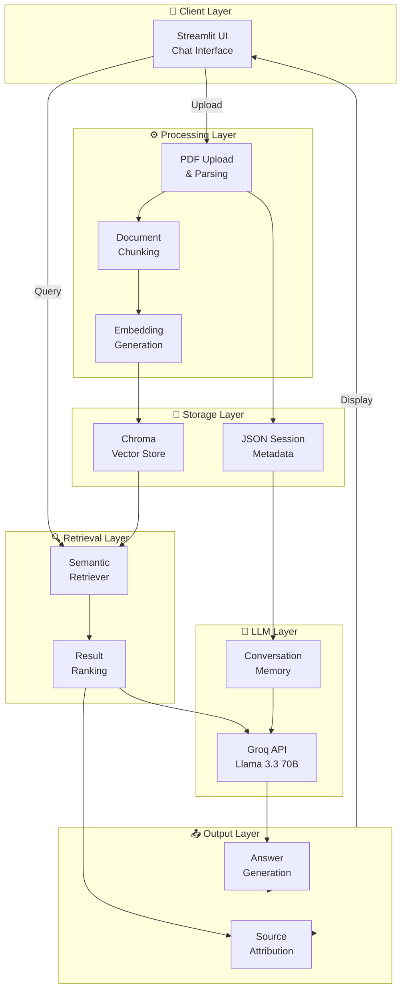
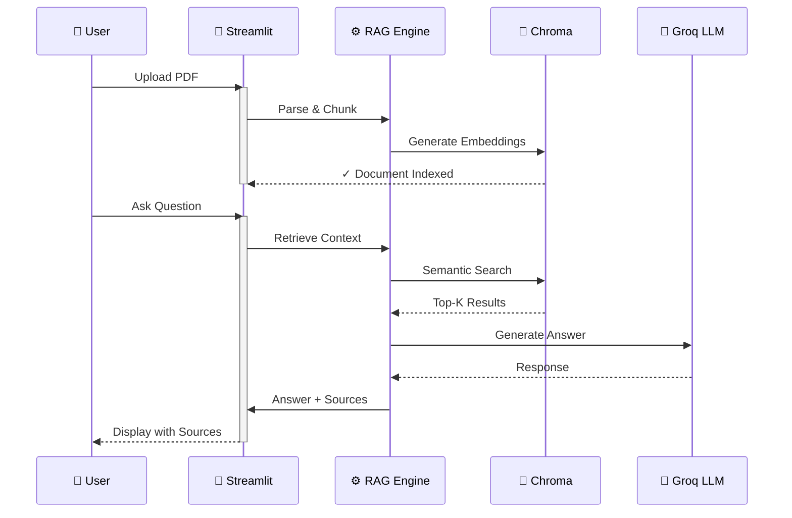
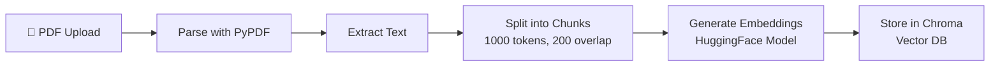
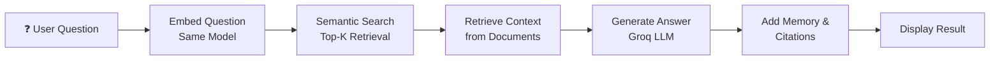

# 📄 RAG Document Q&A System

<div align="center">

### Intelligent Document Analysis with Retrieval-Augmented Generation

**Ask questions. Get answers. From your documents.**


</div>

---

## 🚀 Overview

**RAG Document Q&A** is a cutting-edge application that combines vector embeddings, semantic search, and large language models to enable intelligent question-answering over your document collections. Upload PDFs, create organized chat sessions, and get context-aware answers with source citations in milliseconds.

Perfect for researchers, analysts, students, and professionals who need to extract insights from document collections efficiently.

---

## ✨ Key Features

- 🎯 **Multi-Session Management** - Create and organize multiple independent chat sessions
- 📚 **Batch Document Handling** - Upload multiple PDFs to a single session
- 🔍 **Semantic Search** - Intelligent retrieval using advanced embeddings
- 💬 **Conversational Memory** - Context-aware Q&A with conversation history
- 📌 **Source Attribution** - See exactly which documents your answers come from
- ⚡ **Performance Metrics** - Real-time latency tracking and session statistics
- 🧠 **Advanced LLM** - Powered by Groq's Llama 3.3 70B
- 🎨 **Intuitive UI** - Beautiful, responsive Streamlit interface
- 💾 **Persistent Storage** - All sessions and vectors stored locally

---

## 🏗️ System Architecture



---

## 📊 Data Flow Diagram



---

## 🛠️ Tech Stack

| Component | Technology | Purpose |
|-----------|-----------|---------|
| **Frontend** | Streamlit | Interactive web interface |
| **LLM** | Groq (Llama 3.3 70B) | Answer generation |
| **Embeddings** | HuggingFace (all-MiniLM-L6-v2) | Semantic search |
| **Vector Store** | Chroma | Persistent vector database |
| **Framework** | LangChain | RAG orchestration |
| **PDF Processing** | PyPDF | Document parsing |
| **Session Management** | JSON | Metadata storage |

---

## 📦 Installation

### Prerequisites
- Python 3.9 or higher
- pip package manager
- Internet connection (for first-time model downloads)

### Step 1: Clone & Setup

```bash
# Navigate to project directory
cd "RAG Document Q&A"

# Create virtual environment (recommended)
python -m venv venv

# Activate virtual environment
# On Windows:
venv\Scripts\activate
# On macOS/Linux:
source venv/bin/activate
```

### Step 2: Install Dependencies

```bash
pip install -r requirments.txt
```

### Step 3: Configure API Keys

Create a `.env` file in the project root:

```bash
GROQ_API_KEY=your_groq_api_key_here
```

Get your free Groq API key: https://console.groq.com

### Step 4: Run the Application

```bash
streamlit run app.py
```

The application will open in your browser at `http://localhost:8501`

---

## 🎯 Usage Guide

### Create a New Chat Session

1. Click **"New Chat"** button in the sidebar
2. A new chat session is created with auto-generated name
3. Customize the chat name in the main area

### Upload Documents

1. In the left panel, click **"Add PDF to this chat"**
2. Select one or multiple PDF files
3. Files are automatically processed, indexed, and embedded
4. Wait for the ✓ confirmation

### Ask Questions

1. Once documents are indexed, the chat input box activates
2. Type your question in the chat input
3. The system searches through document vectors
4. Groq LLM generates context-aware answer
5. Sources are cited with document name and page number

### Monitor Performance

**Session Statistics** show:
- **Pages**: Total pages across all documents
- **Chunks**: Number of text segments created
- **Questions**: Total questions asked in session
- **Avg ms**: Average response time in milliseconds

### Manage Sessions

- **View**: Click any session in history to open it
- **Rename**: Edit the chat name at the top
- **Delete**: Click the 🗑️ icon to remove a session

---

## 📁 Project Structure

```
RAG Document Q&A/
├── app.py                    # Main Streamlit application
├── rag.py                    # RAG engine & core logic
├── requirments.txt           # Python dependencies
├── sessions.json             # Session metadata storage
├── .env                      # Environment variables (create this)
├── Readme.md                 # This file
├── chroma_db/                # Legacy vector stores (old sessions)
└── chroma_sessions/          # Active session vector stores
    └── {session_id}/
        ├── chroma.sqlite3    # Vector database
        └── {uuid}/           # Chroma collection data
```

---

## 🔄 How It Works

### Phase 1: Document Ingestion


### Phase 2: Question Answering


---

## ⚡ Performance Characteristics

| Metric | Value | Notes |
|--------|-------|-------|
| **Avg Query Time** | 2-5 sec | Depends on document size & complexity |
| **Embedding Model** | all-MiniLM-L6-v2 | 384-dimensional vectors |
| **LLM Latency** | 1-3 sec | Via Groq API |
| **Max Chunk Size** | 1000 tokens | ~750 words |
| **Retrieval K** | 4 documents | Top-4 most relevant chunks |
| **Memory Window** | Last 10 exchanges | Conversational context |

---

## 🔑 Core Components

### `app.py` - Streamlit Interface
- Session management UI
- PDF upload handler
- Chat display with formatting
- Real-time statistics
- Responsive layout (sidebar + main)

### `rag.py` - RAG Engine
- Session CRUD operations
- Document processing pipeline
- Vector store management
- QA chain orchestration
- Conversation memory handling

### Key Functions

#### Session Management
```python
create_session(name)          # Create new chat session
delete_session(session_id)    # Remove session & vectors
get_session(session_id)       # Fetch session data
update_session(session_id, data)  # Update metadata
```

#### Document Processing
```python
add_document_to_session(session_id, pdf_path, filename)
# - Parses PDF
# - Chunks documents
# - Generates embeddings
# - Stores in Chroma
```

#### Question Answering
```python
answer_question(session_id, question)
# Returns: (answer_text, sources_list, latency_ms)
```

---

## 🚀 Advanced Features

### Conversational Memory
The system maintains the last 10 Q&A exchanges, allowing natural follow-up questions and context awareness.

### Source Attribution
Every answer includes exact source references:
- Document filename
- Page number
- Confidence through retrieval ranking

### Batch Processing
Documents are processed in batches of 50 to optimize memory usage with large PDFs.

### Error Handling
- Empty chunks filtered out
- Missing documents handled gracefully
- Invalid PDFs logged appropriately

---

## 🔒 Privacy & Security

✅ **All data stored locally** - No documents sent to external servers except Groq API  
✅ **No analytics tracking** - Full privacy by default  
✅ **Session isolation** - Each session has independent vectors  
✅ **API key protection** - Use .env for credentials  

---

## 🎓 Example Queries

Once you have documents indexed, try:

- *"Summarize the key points from these documents"*
- *"What are the main findings?"*
- *"List all dates mentioned in the documents"*
- *"Compare these two concepts across documents"*
- *"What are the recommendations?"*
- *"Extract contact information"*

---

## 🐛 Troubleshooting

### Issue: "No documents uploaded yet"
**Solution**: Ensure PDFs are uploaded and processing completes (check spinner)

### Issue: "I couldn't find this in the uploaded documents"
**Solution**: LLM correctly responding - your question may not be in the documents

### Issue: Slow response times
**Solution**: 
- Large PDFs take longer to process
- More documents = slower retrieval
- Check internet connection for Groq API

### Issue: GROQ_API_KEY error
**Solution**: Create `.env` file with valid API key from https://console.groq.com

---

## 📈 Future Enhancements

- [ ] Multi-modal support (images, tables, formulas)
- [ ] Web URL document ingestion
- [ ] Real-time document updates
- [ ] Advanced query filtering & reranking
- [ ] User authentication & multi-user support
- [ ] Conversation export (PDF, Markdown)
- [ ] Custom LLM model selection
- [ ] Document summarization UI
- [ ] Citation export formats (APA, MLA, Chicago)
- [ ] Performance analytics dashboard

---

## 🤝 Contributing

Contributions are welcome! Please:

1. Fork the repository
2. Create a feature branch (`git checkout -b feature/amazing-feature`)
3. Commit changes (`git commit -m 'Add amazing feature'`)
4. Push to branch (`git push origin feature/amazing-feature`)
5. Open a Pull Request

---

## 📝 License

This project is licensed under the MIT License - see the LICENSE file for details.

---

## 💬 Support

Having issues? 
- Check the Troubleshooting section above
- Review your `.env` file configuration
- Ensure all dependencies are installed: `pip install -r requirments.txt`
- Check Groq API status and quota

---

## 🎉 Acknowledgments

Built with ❤️ using:
- [Streamlit](https://streamlit.io) - Web app framework
- [LangChain](https://langchain.com) - RAG orchestration
- [Groq](https://groq.com) - Lightning-fast LLM inference
- [Chroma](https://www.trychroma.com) - Vector database
- [HuggingFace](https://huggingface.co) - Embeddings & models

---

<div align="center">

**Made with ❤️ for document lovers**

*Last updated: May 2026*

</div>